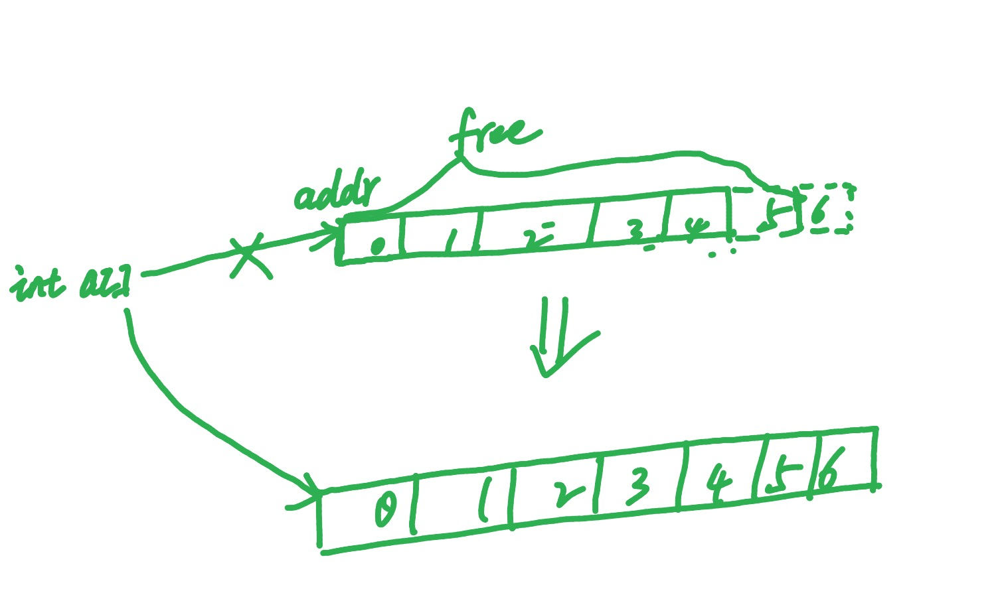

# Array 数组

### 概念

当创建一个数组时,会分配一段虚拟地址空间,然后将第一个元素地址进行返回。该数组长度就是`元素类型长度*元素个数`。



```c
#include <stdlib.h>
#include <stdio.h>


int main(int argc, char **argv)
{
	int x[4] = {1, 2, 3};

	printf("%d\n", *x);
	return 0;
}
```

* 查看x地址和x地址空间存储数据

```c
(gdb) info locals;
x = {1, 2, 3, 0}
(gdb) p/x &x
$1 = 0x7fffffffe270
(gdb) x/3w 0x7fffffffe270
0x7fffffffe270:	0x00000001	0x00000002	0x00000003
(gdb) x/w 0x7fffffffe270 + 4
0x7fffffffe274:	0x00000002
(gdb) x/w 0x7fffffffe270 + 8
0x7fffffffe278:	0x00000003
```

通过调试输出结果可以得知,x是一个指向第一个元素的地址。通过地址偏移操作可以获取第二个、第三个元素内容。


#### 可变长数组

如果数组具有自动生存周期,且没有static修饰符,那么可以用非常量表达式来定义数组。

```c
#include <stdlib.h>
#include <stdio.h>


int main(int argc, char **argv)
{
	int x[] = {1, 2, 3};

	printf("%d\n", *x);
	return 0;
}
```

* 通过调试查看编译器如何处理可变长数组

```c
Dump of assembler code for function main:
   0x000000000040051d <+0>:	push   rbp
   0x000000000040051e <+1>:	mov    rbp,rsp
   0x0000000000400521 <+4>:	sub    rsp,0x20
   0x0000000000400525 <+8>:	mov    DWORD PTR [rbp-0x14],edi
   0x0000000000400528 <+11>:	mov    QWORD PTR [rbp-0x20],rsi
   0x000000000040052c <+15>:	mov    DWORD PTR [rbp-0x10],0x1
   0x0000000000400533 <+22>:	mov    DWORD PTR [rbp-0xc],0x2
   0x000000000040053a <+29>:	mov    DWORD PTR [rbp-0x8],0x3
=> 0x0000000000400541 <+36>:	mov    eax,DWORD PTR [rbp-0x10]
   0x0000000000400544 <+39>:	mov    esi,eax
   0x0000000000400546 <+41>:	mov    edi,0x4005f0
   0x000000000040054b <+46>:	mov    eax,0x0
   0x0000000000400550 <+51>:	call   0x400400 <printf@plt>
   0x0000000000400555 <+56>:	mov    eax,0x0
   0x000000000040055a <+61>:	leave
   0x000000000040055b <+62>:	ret
```

通过调试结果可以看到,针对这种源代码中设置的可变长数组。编译器在编译期间自动流程指定大小空间的Stack空间。


#### 下标存储

`x[i]`相当于`*(x+i)`,数组名默认指向第一元素的指针。C语言不会对数组下标索引进行返回检查,编码时需要注意边界检查。数组名默认是指向第一个元素指针的常量,而`&x[i]`则返回`int*`类型指针,指向目标序列号元素。

```c
#include <stdlib.h>
#include <stdio.h>


int main(int argc, char **argv)
{
	int x[] = {1, 2, 3, 4};

	x[1] = 20;
	printf("%d\n", *(x+1));

	*(x+2) = 20;
	printf("%d\n", x[2]);

	printf("%d\n", *x);

	return 0;
}
```

* 通过gdb查看执行结果

```c
(gdb) disassemble
Dump of assembler code for function main:
   0x000000000040051d <+0>:	push   rbp
   0x000000000040051e <+1>:	mov    rbp,rsp
   0x0000000000400521 <+4>:	sub    rsp,0x20
   0x0000000000400525 <+8>:	mov    DWORD PTR [rbp-0x14],edi
   0x0000000000400528 <+11>:	mov    QWORD PTR [rbp-0x20],rsi
   0x000000000040052c <+15>:	mov    DWORD PTR [rbp-0x10],0x1
   0x0000000000400533 <+22>:	mov    DWORD PTR [rbp-0xc],0x2
   0x000000000040053a <+29>:	mov    DWORD PTR [rbp-0x8],0x3
   0x0000000000400541 <+36>:	mov    DWORD PTR [rbp-0x4],0x4
   0x0000000000400548 <+43>:	mov    DWORD PTR [rbp-0xc],0x14
   0x000000000040054f <+50>:	mov    eax,DWORD PTR [rbp-0xc]
   0x0000000000400552 <+53>:	mov    esi,eax
   0x0000000000400554 <+55>:	mov    edi,0x400630
   0x0000000000400559 <+60>:	mov    eax,0x0
   0x000000000040055e <+65>:	call   0x400400 <printf@plt>
   0x0000000000400563 <+70>:	mov    DWORD PTR [rbp-0x8],0x14
   0x000000000040056a <+77>:	mov    eax,DWORD PTR [rbp-0x8]
   0x000000000040056d <+80>:	mov    esi,eax
   0x000000000040056f <+82>:	mov    edi,0x400630
   0x0000000000400574 <+87>:	mov    eax,0x0
   0x0000000000400579 <+92>:	call   0x400400 <printf@plt>
=> 0x000000000040057e <+97>:	mov    eax,DWORD PTR [rbp-0x10]
   0x0000000000400581 <+100>:	mov    esi,eax
   0x0000000000400583 <+102>:	mov    edi,0x400630
   0x0000000000400588 <+107>:	mov    eax,0x0
   0x000000000040058d <+112>:	call   0x400400 <printf@plt>
   0x0000000000400592 <+117>:	mov    eax,0x0
   0x0000000000400597 <+122>:	leave
   0x0000000000400598 <+123>:	ret
End of assembler dump.
(gdb) info locals;
x = {1, 20, 20, 4}
(gdb) x/4w &x
0x7fffffffe270:	1	20	20	4
```

通过输出结果得知,可以使用指针或x[]两种方式操作数组。


#### 数组初始化

数组进行初始化时,除了使用下标初始化外,还可以直接用初始化器。

##### 初始化规则

* 如果数组为静态生存周期,那么初始化器必须是常量表达式。

* 如果提供初始化器,那么可以不提供数组长度,由初始化器的最后一个元素决定。

* 如果同时提供长度和初始化器那么没有提供初始化值的元素都被初始化为0或者NULL。

```c
int main(int argc, char **argv) {
  int y[] = {1, 2, 3};
  int z[5] = {1, 2 };
   
  int a[][2] =
  {
    {1, 2},
    {2, 3},
    {3, 4},
  };
  	
  int q[3] = {};
  	
  return 0;
}
```

以上实例是4种常见的数组初始化方式。在进行初始化时,如果没有对下标进行赋值操作。则使用"0"值进行填充。

```c
(gdb) info locals;
y = {1, 2, 3}
z = {1, 2, 0, 0, 0}
a = {{1, 2}, {2, 3}, {3, 4}}
q = {0, 0, 0}
```

##### 初始化器种初始化特定元素

```c
#include <stdlib.h>
#include <stdio.h>

int main(int argc, char **argv)
{
  	int x[] = {1, 2, 3, [10] = 100, 11};

	int len = sizeof(x)/sizeof(int);

	for(int i = 0; i < len; i++)
	{
		printf("x[%d] = %d\n", i, x[i]);
	}
	return 0;
}
```

调试结果:

```c
(gdb) info locals;
x = {1, 2, 3, 0, 0, 0, 0, 0, 0, 0, 100, 11}
len = 12
(gdb) x/12w &x
0x7fffffffe240:	1	2	3	0
0x7fffffffe250:	0	0	0	0
0x7fffffffe260:	0	0	100	11
```

当指定初始化特定元素的下标后,下一个元素的下标在当前下标的基础上加1。被跳过的数组元素使用"0"值补充。


### 多维数组

多维数组就是"元素为数组"的数组,注意元素数组,并不是数组指针。多维数组的第一个维度下标可以不指定。

```c
#include <stdlib.h>
#include <stdio.h>

int main(int argc, char **argv)
{
	int x[][2] = {
		{1, 11},
		{2, 22},
		{3, 33}
	};

	int col = 2, row = sizeof(x)/sizeof(int)/col;

	for (int r = 0; r < row; r++)
	{
		for (int c = 0; c < col; c++)
		{
			printf("x[%d][%d] = %d\n", r, c, x[r][c]);
		}
	}
	return 0;
}
```

调试结果:

```c
(gdb) info locals;
x = {{1, 11}, {2, 22}, {3, 33}}
col = 2
row = 3
(gdb) x/6xw &x
0x7fffffffe240:	0x00000001	0x0000000b	0x00000002	0x00000016
0x7fffffffe250:	0x00000003	0x00000021
```

#### 多维数组转一维数组

二维数组通常也被成为"矩阵(matrix)",相当于一个`row * column`的表格。比如`x[3][2]`相当于三行两列的表格。多维数组的元素是连续排列的,这也是区别指针数组的一个重要特征。

```c
#include <stdlib.h>
#include <stdio.h>

int main(int argc, char **argv)
{
	int x[][2] = {
		{1, 11},
		{2, 22},
		{3, 33}
	};

	int len = sizeof(x)/sizeof(int);
	int *p = (int*)x;

	for (int i = 0; i < len; i++)
	{
		printf("x[%d] = %d\n", i, p[i]);
	}
	return 0;
}
```

调试结果:

```c
(gdb) info locals;
x = {{1, 11}, {2, 22}, {3, 33}}
len = 6
p = 0x7fffffffe250
(gdb) p/x p
$2 = 0x7fffffffe250
(gdb) x/6xw 0x7fffffffe250
0x7fffffffe250:	0x00000001	0x0000000b	0x00000002	0x00000016
0x7fffffffe260:	0x00000003	0x00000021
```


希望对当前数组进行扩容或者缩容时,可以使用realloc()函数进行。当扩容/缩容时如果在当前区域有空闲的area,该区域的内容保持不变,之后向数组后面的area进行扩容,返回原来的PTR。如果无法在现有Area区域进行扩容,需要在新的Area区域开辟一块指定大小的空间(旧数组大小+扩容大小),然后将旧数据拷贝新的区域,返回新Area第一个元素地址。
