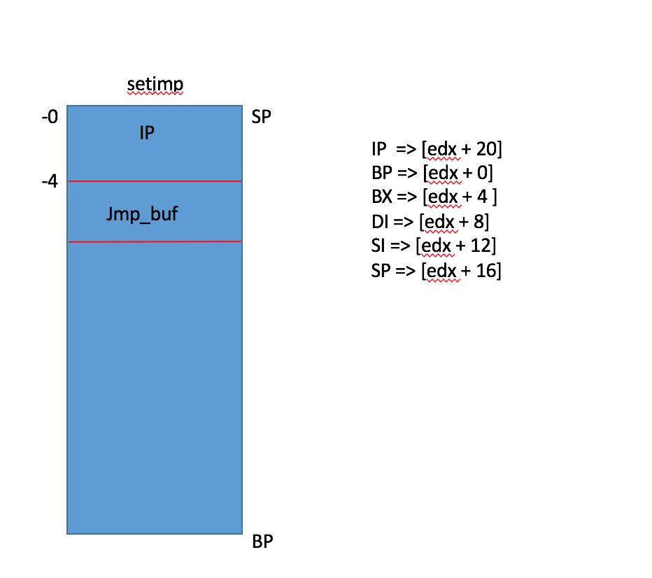
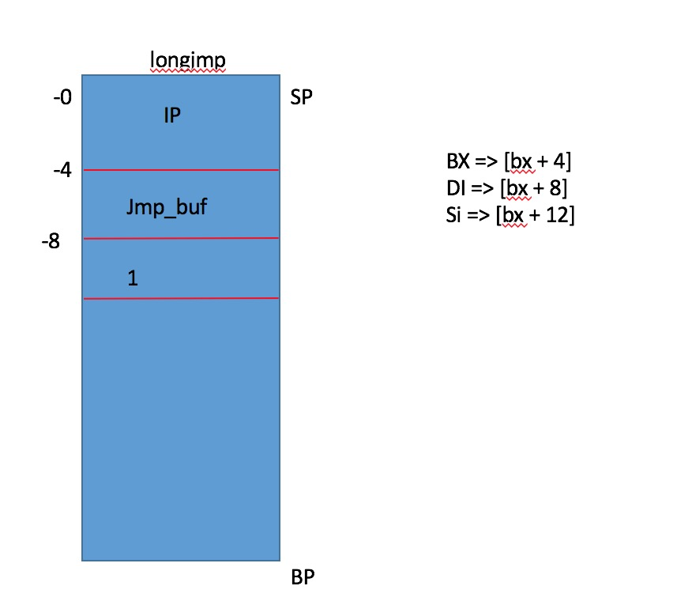

### C 标准库 － <setjmp.h>

#### 简介

        在c语言中,goto语句仅支持在单函数内实现label跳转。如果想在多个函数之间实现label跳转,可以使用setjmp标准库

setjmp和longjmp完成分支跳转。


#### 实例1:

```c
#include <setjmp.h>
#include <stdlib.h>
#include <stdio.h>

static jmp_buf env;

double divide(double a, double b)
{
	if (b == 0){
    longjmp(env, 1);
  }  
  return a / b;
}

int main(int artc, char **argv)
{
  if (setjmp(env) == 0) {
    divide(2, 0);
  } else {
    printf("Canot / 0");
  }
   
  printf("Done!");
    
  return 0;
}
 
> gcc -g3 -std=c11 -Wall -Wpedantic -o test test.c && ./test
> "Canot / 0"
> "Done!"
```

### 实现原理

        这种跨函数Label跳转采用栈帧寄存器BP、PC、SP指针寄存器完成跳转。setjmp 和longjmp实现label跳转共使用了

bp、sp、si、di、bx、ip等寄存器。如下具体代码实现:

```c

typedef struct {
  unsigned long ebp;
  unsigned long ebx;
  unsigned long edi;
  unsigned long esi;
  unsigned long esp;
  unsigned long eip;
} jmp_buf[1];

#define OFS_EBP   0
#define OFS_EBX   4
#define OFS_EDI   8
#define OFS_ESI   12
#define OFS_ESP   16
#define OFS_EIP   20

__declspec(naked) int setjmp(jmp_buf env) {
  __asm {
    mov edx, 4[esp]          // Get jmp_buf pointer
    mov eax, [esp]           // Save EIP
    mov OFS_EIP[edx], eax
    mov OFS_EBP[edx], ebp    // Save EBP, EBX, EDI, ESI, and ESP
    mov OFS_EBX[edx], ebx
    mov OFS_EDI[edx], edi
    mov OFS_ESI[edx], esi
    mov OFS_ESP[edx], esp
    xor eax, eax             // Return 0
    ret
  }
}

__declspec(naked) void longjmp(jmp_buf env, int value) {
  __asm {
    mov edx, 4[esp]          // Get jmp_buf pointer
    mov eax, 8[esp]          // Get return value (eax)

    mov esp, OFS_ESP[edx]    // Switch to new stack position
    mov ebx, OFS_EIP[edx]    // Get new EIP value and set as return address
    mov [esp], ebx
    
    mov ebp, OFS_EBP[edx]    // Restore EBP, EBX, EDI, and ESI
    mov ebx, OFS_EBX[edx]
    mov edi, OFS_EDI[edx]
    mov esi, OFS_ESI[edx]

    ret
  }
}
```

        <p>当调用setjmp函数时,会将当前环境进行现场保护(保存到BX寄存器),以便longjmp函数后续使用。当调用

longjmp(jmp_buf env, int value)函数时,value作为返回值setjmp()函数返回。使用IP、SP和BP恢复setjmp()函数现场。回

到setjmp()函数sp位置,重新进行if(setjmp(env) == 0) 比较,此时结果已经为1,所以直接执行分支结构下内容。</p>


##### setjmp 现场保护




##### longjmp 现场恢复




##### 代码示意图


(End)


